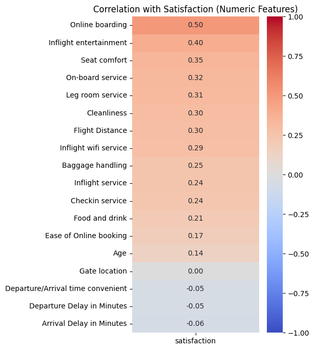
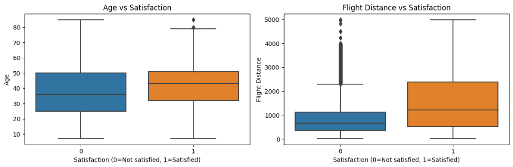

# Airline Passenger Satisfaction: An End-to-End Machine Learning Solution

## Business Overview and Strategic Value

### The Challenge: Retention in a Competitive Landscape

In the modern aviation industry, customer experience (CX) is the new battlefield. With comparable pricing and routes across carriers, satisfaction is the primary differentiator driving retention and lifetime value (LTV). Dissatisfied passengers not only churn but actively detract from brand equity.

**Strategic Objective**:
To deploy a scalable, data-driven framework that transforms raw passenger feedback into actionable intelligence. This solution empowers stakeholders to:

1. **Predict Churn Risk**: Identify dissatisfied passengers with 96% accuracy before they leave.
2. **Optimize Service Allocation**: Quantify the impact of specific services (e.g., Inflight WiFi, Leg room) on overall sentiment.
3. **Personalize Value Propositions**: Segment customers (Business vs. Personal) to tailor retention strategies.

### Validation and Insights

- **The Loyalty Multiplier**: Business travelers are the most sensitive segment; operational excellence here yields the highest ROI on loyalty.
- **Digital Engagement**: Features like Online Boarding and Inflight WiFi correlate strongly with satisfaction (r > 0.5), suggesting digital transformation is a key lever for CX improvement.
- **Economy Class Opportunity**: A significant satisfaction gap exists in Economy tiers, highlighting a potential area for cost-effective service upgrades to boost retention.

---

## Data Pipeline and System Architecture

This project implements a robust, reproducible Machine Learning pipeline designed for modularity and scalability. The codebase is organized to support experimentation and deployment alike.

### 1. Data Ingestion and Validation

- **Source**: Raw CSV datasets (Train/Test) containing 120k+ passenger records.
- **Validation**:
  - Automated checks ensure schema consistency (Age, Gender, Class, Flight Distance, etc.).
  - Verified unique identifiers to prevent data leakage between splits.

### 2. Feature Engineering and Preprocessing

The pipeline transforms raw data into model-ready vectors through a strict preprocessing regimen, handled by the `preprocessing.py` module:

- **Imputation Strategy**:
  - *Numerical*: Median imputation is used for skew-sensitive fields like `Arrival Delay`, ensuring robustness against outliers.
  - *Categorical*: Mode imputation for missing demographic data to maintain distibution integrity.
- **Dimensionality Handling**:
  - **One-Hot Encoding**: Applied to nominal variables (`Type of Travel`, `Customer Type`, `Class`) to prevent ordinal bias in linear models.
  - **Label Encoding**: Used for the target binary variable (`satisfaction`).
- **Normalization**: `StandardScaler` standardizes numerical features (`Age`, `Flight Distance`) to zero mean and unit variance, essential for convergence in Logistic Regression and distance-based metrics.

### 3. Model Training and Evaluation

A multi-model approach was taken to balance interpretability with predictive power, executed via `modeling.py`:

- **Logistic Regression (Baseline)**: Selected for its transparency. The coefficients provide direct "odds ratios" for each feature, allowing business stakeholders to validate the intuition behind predictions.
- **Random Forest Classifier (Champion)**: Selected for performance. Its ensemble nature captures complex, non-linear feature interactions (e.g., the compounding frustration of *Departure Delay* + *Poor Wifi*), achieving superior accuracy.

---

## Visualizations and Key Findings

### Feature Correlation Analysis

Mapping numerical features against the target variable reveals the richest drivers of satisfaction.

*Figure 1: Correlation heatmap showing strong positive relationships for Online Boarding and Inflight Entertainment.*

### Demographic Profiling

Analyzing satisfaction across key demographics helps refine customer personas.

*Figure 2: Distribution of Age and Flight Distance. Business travelers traveling longer distances tend to have more polarized satisfaction scores, indicating high stakes for long-haul flights.*

---

## Project Structure

The project follows a standard data science directory layout, ensuring reproducibility and separation of concerns. This modular design allows different components (preprocessing, modeling, evaluation) to be maintained independently.

```text
├── airline_satisfaction/       # Source code package (Modular Logic)
│   ├── __init__.py
│   ├── data_utils.py           # Utilities for data loading and splitting
│   ├── preprocessing.py        # Pipeline definitions (Imputers, Scalers, Encoders)
│   ├── modeling.py             # Model training wrappers and definitions
│   ├── evaluation.py           # Metric calculation and reporting functions
│   └── feature_importance.py   # Logic for extracting feature importances
├── data/                       # Dataset directory
│   └── (Contains train.csv and test.csv)
├── figures/                    # Generated plots and reporting assets
│   ├── age_distance_distribution.png
│   ├── correlation_heatmap.png
│   ├── feature_importance.png
│   └── satisfaction_age_distance.png
├── models/                     # Serialized models and artifacts
├── notebooks/                  # Interactive analysis environment
│   └── airline-passenger-satisfaction-eda-ml.ipynb  # Primary notebook for EDA and Modeling
├── scripts/                    # Production-ready Python scripts
│   ├── evaluate_model.py       # Script for evaluating model performance
│   ├── extract_plots.py        # Utility script to reproduce figures
│   └── train_model.py          # Script to run the full training pipeline
├── .gitignore                  # Git exclusion rules
├── README.md                   # Project documentation (this file)
├── pyproject.toml              # Build system configuration
└── requirements.txt            # Python dependencies
```

### Reproducibility

This project is designed to be fully reproducible. The `scripts/` directory contains executable modules that mirror the logic found in the notebooks, ensuring that results can be consistently regenerated. The core logic is abstracted into the `airline_satisfaction` package, promoting code reuse.

---

## Getting Started

### Prerequisites

- Python 3.8+
- `pip` package manager

### Installation

1. **Clone the repository**:

    ```bash
    git clone https://github.com/yourusername/airline-passenger-satisfaction.git
    cd airline-passenger-satisfaction
    ```

2. **Install dependencies**:

    ```bash
    pip install -r requirements.txt
    ```

### Execution

- **Run the full analysis**:
    Open and execute cells in `notebooks/airline-passenger-satisfaction-eda-ml.ipynb.ipynb`.
- **Generate Figures**:

    ```bash
    python scripts/extract_plots.py
    ```

---

## Detailed Results

| Model | Accuracy | F1-Score | Business Impact |
|-------|----------|----------|-----------------|
| Logistic Regression | ~87% | 0.87 | High interpretability; clear roadmap for service improvements. |
| Random Forest | ~96% | 0.96 | High performance; best for deployment in automated targeting systems. |

**Conclusion**: The Random Forest model yields superior predictive power, making it suitable for a real-time recommendation engine. However, the Logistic Regression analysis provided the actionable insights needed for strategic decision-making (e.g., prioritizing Inflight Wifi upgrades).

---

## Contact and Author

**Ali Kagan Mart**
*Data Scientist*

If you have any questions, feedback, or would like to discuss this project further, please do not hesitate to reach out.

- **Email**: [dev.alikaganmart@gmail.com]
- **LinkedIn**: [https://www.linkedin.com/in/kaganmart9/]
- **Portfolio**: [https://kaganmart9.github.io/]
